# Etec Vasco Antônio Venchiarruti  
## Desenvolvimento de sistemas  
### 2C1

**Autores:**  
- Murilo Lazzarini  
- Pedro Boriero

  
## Projeto 1: Primeiro Aplicativo

### Descrição
Tem como objetivo utilizar um botão para que quando clicado apareça a frase “Hello world”  

Ao clicar em “Clique aqui!!” a frase aparece, ao clicar em limpar a frase é apagada  
Alteramos as cores do botão para que eles sejam mais chamativo  

### Print das telas do Design
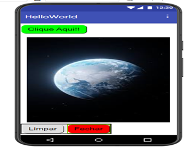  

### Print das telas dos Blocos
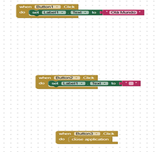  

## Projeto 2: Segundo Aplicativo

### Descrição
Objetivo de poder pintar a imagem escolhida  

Ao clicar no botão de uma das cores você pode fazer um desenho na imagem  
Alteração da imagem  

### Print das telas do Design
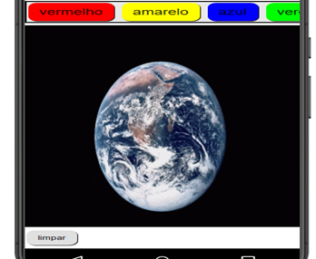  

### Print das telas dos Blocos
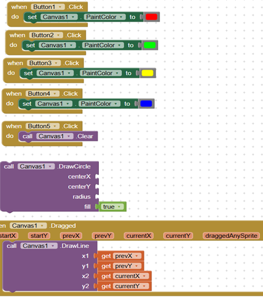 

## Projeto 3: Terceiro Aplicativo

### Descrição
Objetivo de ao clicar na imagem fazer um barulho  

Ao clicar na imagem ela faz um barulho  
Utilizamos o som da abelha  

### Print das telas do Design
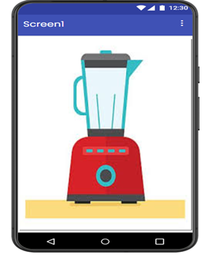  

### Print das telas dos Blocos
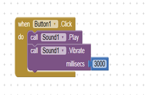  

## Projeto 4: Quarto Aplicativo

### Descrição
Nesse aplicativo vamos utilizar o recurso da câmera do celular para tirar uma foto.  

### Print das telas do Design
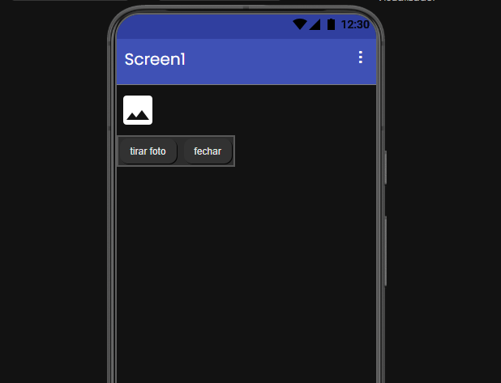  

### Print das telas dos Blocos
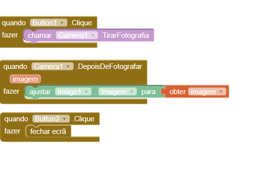  

## Projeto 5: Quinto Aplicativo

### Descrição
Nessa aplicação, a ideia é inserir telas adicionais na tela principal (Screen1).  
Assim, vamos elaborar um aplicativo que irá navegar em três telas diferentes.  

### Print das telas do Design
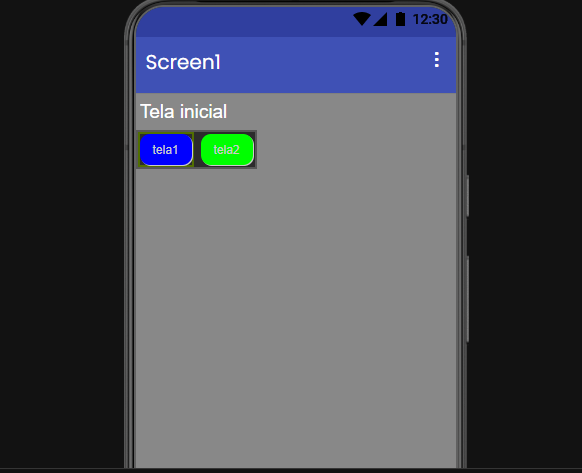  
 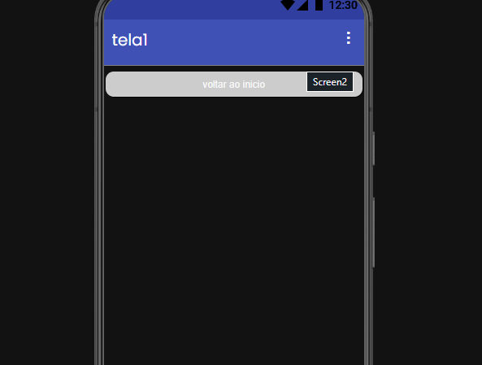  
 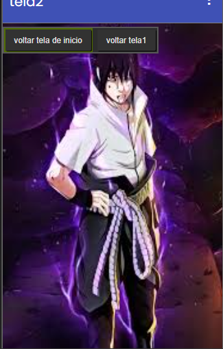  

### Print das telas dos Blocos
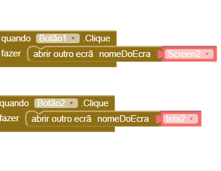

 

## Projeto 6: Sexto Aplicativo

### Descrição
Nesse projeto será deselvolvido um programa semelhante a primeira aplicação (OláMundo).  
A diferença é que esse novo aplicativo vai usar o teclado para inserir um texto e o nome do usuário será exibido na saudação que será criada.  

### Print das telas do Design
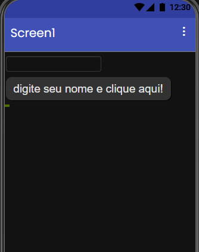  

### Print das telas dos Blocos
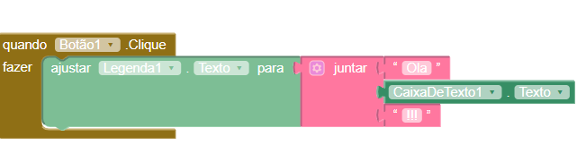 
